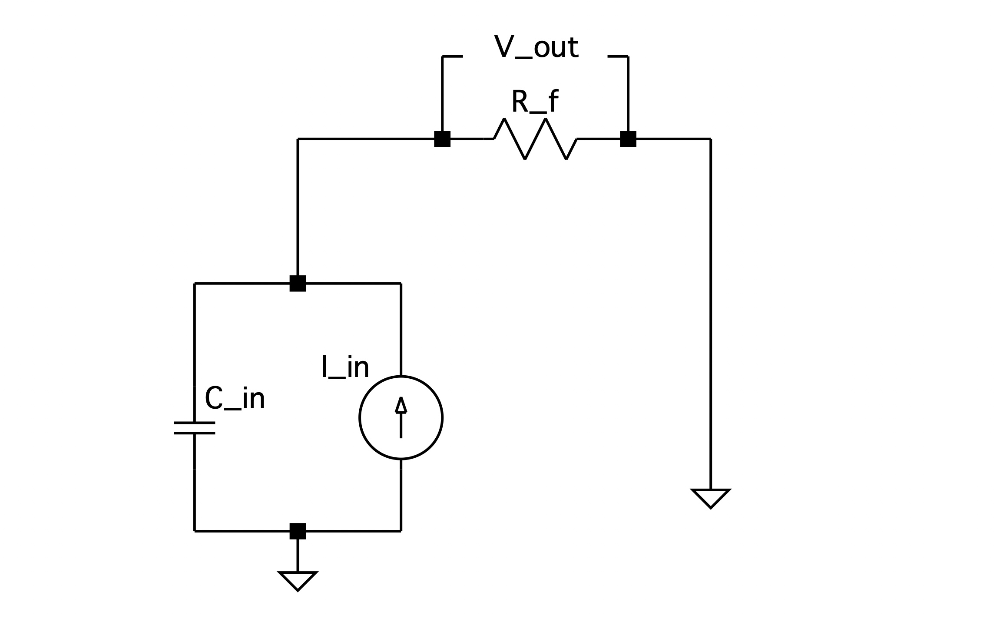
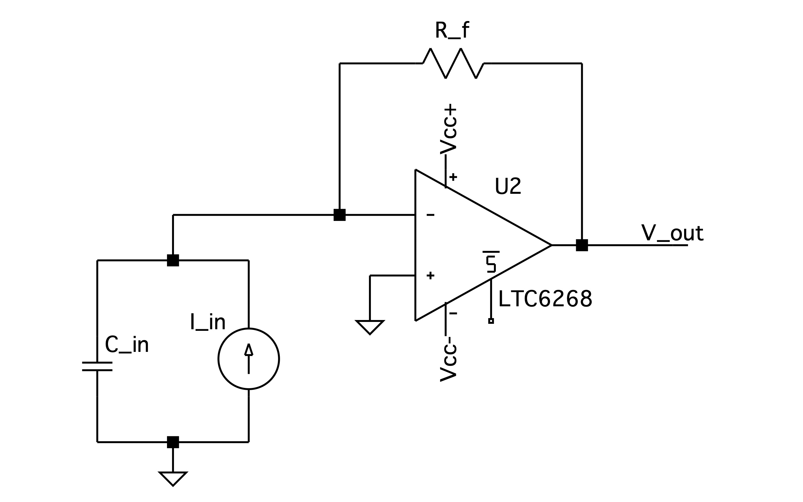
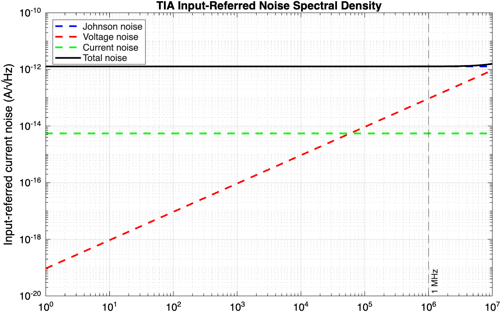
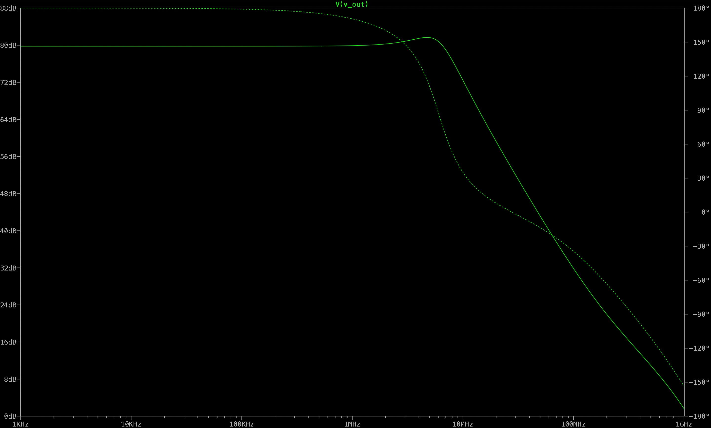
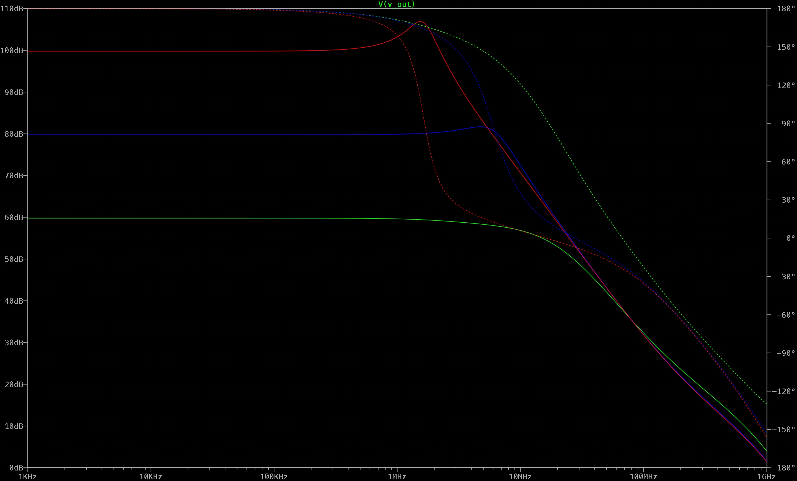

<!-- slide -->

# Transimpedance Amplifier Design for Optical Power Meter

## 1. Application and Motivation

This application, a transimpedance amplifier (TIA), is designed as the front-end amplifier for a benchtop optical power meter measuring modulated laser sources up to 1 MHz in frequency. It uses a Hamamatsu S5971 silicon PIN photodiode in order to convert incident light into current, which is subsequently converted into a voltage. This voltage can then be digitized by an ADC for further applications.

The TIA front-end is made necessary by the presence of the photodiode's parasitic capacitance. If the photodiode was run to ground through a resistor, a low-pass filter would be formed between the photodiode's capacitance $C_{in}$ and the resistor $R_f$, as depicted in Fig. 1.

*Figure 1: Circuit diagram of photodiode run to ground through resistor*

Performing KCL, and taking Ohm's Law across the resistor $R_f$ in the s-domain:

$$ V_{out} = R_f (I_{in} - sC_{in}V_{out})$$

$$V_{out} = R_f I_{in} - sR_f C_{in} V_{out}$$

$$V_{out} (1 + s R_f C_{in}) = R_fI_{in}$$

$$ \frac{V_{out}}{I_{in}} = \frac{R_f}{1+sR_fC_{in}}$$

$$ \boxed{\frac{V_{out}}{I_{in}} = \frac{R_f}{1 + \frac{s}{{(1/R_fC_{in})}}}} \quad (1)$$

From the transfer function given by Eqn. 1, we can read off the LPF's cornering frequency as $\omega_c = \frac{1}{R_f C_{in}}$ and its DC transimpedance gain as $R_f$. Therefore, if we decrease $R_f$ in order to increase the bandwidth, we decrease the transimpedance gain reciprocally. This tension is what ultimately necessitates a device such as the TIA.

## 2. Design Specifications

| Parameter | Value | Justification |
|---|---|---|
| Transimpedance gain $R_f$ | 10 kΩ | With an expected current of 10 $\mu \text{A}$, this leads to an expected voltage output of 100 mV |
| Input capacitance $C_{in}$ | 3 pF | S5971 datasheet, $V_R = 10$ V |
| Target bandwidth $f_{-3\text{dB}}$ | 1 MHz | The device seeks to measure modulated laser sources up to 1 MHz |
| Required op-amp GBW | ≥ 188 MHz | Derived below, using photodiode capacitance only |

*Table 1: Design Specifications*

## 3. Closed-Loop Transfer Function and Natural Frequency

The circuit diagram of the TIA is depicted in Fig. 2.

*Figure 2: Circuit diagram of TIA*

The op-amp is modelled as a single-pole system with open-loop gain given in the s-domain by:

$$ \boxed{A(s) = \frac{\omega_{GBW}}{s}} \quad (2) $$

Where $\omega_{GBW} = 2\pi (GBW)$. This approximation holds at frequencies that significantly exceed the op-amp's internal cornering frequency, which is typically on the scale of a few Hz.

Performing KCL at the inverting input node:

$$-I_{in} + sC_{in}V_- + \frac{V_--V_{out}}{R_f} = 0 \quad(3)$$

Applying the definition of the open-loop gain of an op-amp, and noting that $V_+ = 0$:

$$ V_{out} = A(s) (V_+ - V_-)$$

$$ \boxed{V_- = -\frac{V_{out}}{A(s)}} \quad (4) $$

Substituting Eqn. 4 into Eqn. 3 and simplifying:

$$ -I_{in} +sC_{in}(\frac{-V_{out}}{A(s)}) + \frac{(\frac{-V_{out}}{A(s)}) \, - \, V_{out}}{R_f} = 0$$

$$ -I_{in} = V_{out}(\frac{sC_{in}}{A(s)} + \frac{\frac{1}{A(s)}+1}{R_f})$$

$$ -I_{in} = V_{out} (\frac{sC_{in}R_f \, +\, 1 \, +\, A(s)}{A(s)R_f}) $$

Substituting Eqn. 2 for $A(s)$:

$$-I_{in} = V_{out} (\frac{sC_{in}R_f \, + \, 1 \, + \, \omega_{GBW}/s}{R_f \omega_{GBW} /s})$$

$$-I_{in} = V_{out} (\frac{s^2C_{in}R_f \, + \, s + \, \omega_{GBW}}{R_f\omega_{GBW}})$$

$$\frac{V_{out}}{I_{in}} = -\frac{\omega_{GBW}R_f}{s^2C_{in}R_f \, + \, s \, + \, \omega_{GBW}}$$

$$\boxed{\frac{V_{out}}{I_{in}} = - \frac{1}{C_{in}R_f} (\frac{\omega_{GBW}R_f}{s^2 \, + \, s \, / \, C_{in}R_f \, + \, \omega_{GBW} \, / \, C_{in}R_f})} \quad (5)$$

The second-order transfer function given by Eqn. 5 has an associated natural angular frequency, $\omega_n$, given by:

$$ \omega_n^2 = \frac{\omega_{GBW}}{C_{in}R_f}$$

$$ \omega_n = \sqrt{\frac{\omega_{GBW}}{R_fC_{in}}}$$

Compared to the first-order LPF where the cornering frequency scaled as $1/R_f$, the inverse square-root is a more favorable relationship. For example, in the first-order arrangement, doubling $R_f$ results in a halving of the bandwidth. In the second-order arrangement, doubling $R_f$ only multiplies the cornering frequency by a factor of $1/\sqrt{2}$, reducing it to a preferable 70.7% of its previous value.

Finally, to determine the linear cornering frequency:
$$f_n = \frac{1}{2\pi}\sqrt{\frac{2\pi(GBW)}{R_fC_{in}}}$$

$$\boxed{f_n = \sqrt{\frac{GBW}{2\pi R_fC_{in}}}} \quad (6)$$

Additionally, from the transfer function given by Eqn. 5, it can be determined that the damping ratio $\zeta$ is given by:

$$ \boxed{\zeta = \frac{1}{2}\sqrt{\frac{1}{\omega_{GBW} R_fC_{in}}}} \quad (7)  $$

## 4. Op-Amp GBW Requirement

By substituting values from Table 1 into Eqn. 6, the minimum GBW for which $f_n \geq 1\,\text{MHz}$ is:

$$GBW = f_n^2 \cdot 2\pi R_f C_{in}$$

$$GBW = (10^6)^2 \cdot 2\pi (10^4)(3\times10^{-12}) \approx 188\,\text{MHz}$$

In order for this figure to guarantee $f_{-3\text{dB}} \geq 1\,\text{MHz}$, it must be shown that $f_{-3\text{dB}} \geq f_n$ throughout the relevant operating range. It is a standard result that for a second-order system, $f_{-3\text{dB}} = f_n$ when $\zeta = 1/\sqrt{2}$, and $f_{-3\text{dB}} > f_n$ when $\zeta < 1/\sqrt{2}$.

Setting $\zeta = 1/\sqrt{2}$ in Eqn. 7 and solving for GBW:

$$\frac{1}{\sqrt{2}} = \frac{1}{2}\sqrt{\frac{1}{\omega_{GBW} R_f C_{in}}}$$

$$\sqrt{2} = \sqrt{\frac{1}{\omega_{GBW} R_f C_{in}}}$$

$$2 = \frac{1}{\omega_{GBW} R_f C_{in}}$$

$$\omega_{GBW} = \frac{1}{2 R_f C_{in}}$$

$$GBW = \frac{1}{4\pi R_f C_{in}} = \frac{1}{4\pi (10^4)(3\times10^{-12})} \approx 2.65\,\text{MHz}$$

Since $\zeta$ decreases monotonically with GBW, any op-amp with $GBW \geq 188\,\text{MHz}$ satisfies $\zeta < 1/\sqrt{2}$, and therefore $f_{-3\text{dB}} > f_n \geq 1\,\text{MHz}$. Note that this figure is a sufficient but not necessary condition; the true minimum GBW is lower than 188 MHz but lacks a clean closed-form solution. The chosen op-amp must therefore have a GBW of at least 188 MHz. This figure drives the parametric search in the following stage.

## 5. Op-Amp Selection

Two op-amps which both fit the requirements were considered: the OPA657 and the LTC6268. Their key parameters are listed in Table 2.

| Parameter | OPA657 | LTC6268 |
|---|---|---|
| GBW | 1600 MHz | 500 MHz |
| $e_n$ | 4.8 nV/$\sqrt{\text{Hz}}$ | 4.3 nV/$\sqrt{\text{Hz}}$ |
| $i_n$ | 1.3 fA/$\sqrt{\text{Hz}}$ | 5.5 fA/$\sqrt{\text{Hz}}$ |
| Input capacitance | 5.2 pF | 0.45 pF |
| Input type | FET (JFET) | FET (CMOS) |

*Table 2: Op-Amp Properties*

Both options comfortably exceed the preliminary GBW requirement of 188 MHz. Owing to its significantly lower input capacitance and slightly lower $e_n$, the LTC6268's voltage noise contribution at the input is considerably lower than that of the OPA657. Both op-amps have current noise low enough to be negligible compared to Johnson noise from $R_f$. Therefore, the LTC6268 was selected as the op-amp for this design.

Because the LTC6268 has non-negligible input capacitance, the GBW requirement must be adjusted. The total input capacitance is $3 \, \text{pF} + 0.45 \, \text{pF} = 3.45 \, \text{pF}$. The adjusted minimum GBW, using $C_{in} = 3.45 \, \text{pF}$, computes to roughly 217 MHz, still well below the LTC6268's listed GBW of 500 MHz. The LTC6268 therefore comfortably meets the design requirements.

## 6. Noise Analysis

The total input-referred current noise has three contributors: Johnson noise from $R_f$, op-amp voltage noise referred to the input through $C_{in}$, and op-amp input current noise. These are uncorrelated random processes and so add in quadrature:

$$i_{total}(f) = \sqrt{\frac{4kT}{R_f} + (2\pi f C_{in} e_n)^2 + i_n^2}$$

At 1 MHz the three contributors evaluate to approximately:

- Johnson noise: $1.29\,\text{pA}/\sqrt{\text{Hz}}$ (dominant, frequency-independent)
- Voltage noise referred to input: $0.093\,\text{pA}/\sqrt{\text{Hz}}$ (rises with frequency)
- Current noise: $0.0055\,\text{pA}/\sqrt{\text{Hz}}$ (negligible, frequency-independent)

The noise spectral density is plotted in Fig. 3. Johnson noise dominates across the entire band of interest. The voltage noise term becomes comparable to Johnson noise only well above 1 MHz, outside the target bandwidth.

*Figure 3: TIA input-referred noise spectral density for the LTC6268 with $R_f = 10\,\text{k}\Omega$*

## 7. Simulation Results

An AC sweep was conducted in LTspice using the LTC6268 SPICE model with $R_f = 10\,\text{k}\Omega$ and $C_{in} = 3.45\,\text{pF}$, sweeping from 1 kHz to 1 GHz. The results are shown in Fig. 4.

*Figure 4: AC sweep of TIA between 1 kHz and 1 GHz*

The simulation confirms the expected TIA frequency response shape. The passband transimpedance is 80 dBΩ, in exact agreement with the theoretical DC gain of $R_f = 10\,\text{k}\Omega$. A slight peak is visible before rolloff, consistent with the heavily underdamped response predicted by $\zeta \approx 0.048$. The simulated $f_{-3\text{dB}}$ is 7.99 MHz, which exceeds the 1 MHz design requirement.

The hand analysis predicts $f_n \approx 48\,\text{MHz}$ using the LTC6268's datasheet GBW of 500 MHz, implying $f_{-3\text{dB}} > 48\,\text{MHz}$. The simulated 7.99 MHz is inconsistent with this prediction. While the LTC6268 is a native Analog Devices model in LTspice, SPICE models are approximations tailored to fit specific operating conditions, and it is possible that this TIA configuration falls outside the model's intended range of usage. This is further discussed in section 9.

## 8. Design Trade-off Analysis

The fundamental tension in TIA design, introduced in Section 1, is between transimpedance gain and bandwidth: increasing $R_f$ raises the transimpedance gain but reduces the bandwidth. To illustrate this, an AC sweep was conducted for $R_f \in \{1\,\text{k}\Omega,\, 10\,\text{k}\Omega,\, 100\,\text{k}\Omega\}$ using the `.step` directive in LTspice. The results are shown in Fig. 5.

*Figure 5: AC sweep of TIA between 1 kHz and 1 GHz, varying $R_f$*

The analytical predictions and simulated results are summarised in Table 3.

| $R_f$ | Passband | $f_n$ (analytical) | $f_{-3\text{dB}}$ (simulated) | Johnson noise at 1 MHz |
|---|---|---|---|---|
| 1 kΩ | 60 dBΩ | 152 MHz | 9.52 MHz | 4.07 pA/$\sqrt{\text{Hz}}$ |
| 10 kΩ | 80 dBΩ | 48 MHz | 7.99 MHz | 1.29 pA/$\sqrt{\text{Hz}}$ |
| 100 kΩ | 100 dBΩ | 15.2 MHz | 2.32 MHz | 0.407 pA/$\sqrt{\text{Hz}}$ |

*Table 3: Trade-off analysis across $R_f$ values*

For all three values of $R_f$, bandwidth decreases monotonically with $R_f$ and the 1 MHz design requirement is exceeded. Therefore, the results of the simulation confirm the expected qualitative behaviour of the TIA. As established in Section 7, the simulated bandwidths are inconsistent with the analytical predictions due to the LTC6268 SPICE model's effective GBW being lower than the datasheet typical, making quantitative comparison between expected and simulated values unreliable. As derived theoretically, an increase in $R_f$ increases the transimpedance gain but decreases the bandwidth, with Johnson noise from $R_f$ decreasing as $R_f$ increases but remaining the dominant noise contributor in all three cases.

## 9. Conclusions

This report presents the design of a transimpedance amplifier front-end for a benchtop optical power meter, targeting a 1 MHz bandwidth. The key decision choices revolved around the resistance of the feedback resistor and the choice of op-amp. The former controls the passband transimpedance gain and bandwidth, and the latter assures that the virtual ground assumption is enforced at expected frequency levels, as well as controlling the magnitude of input noise.

The resistance of the feedback resistor, $R_f$, was selected as $10 \, \text{k}\Omega$, resulting in a transimpedance gain of 80 dBΩ, enough to produce an output voltage of 100 mV from an input current of 10 $\mu\text{A}$. Between the two candidate op-amps, the LTC6268 was chosen over the OPA657 due to its superior noise characteristics combined with comfortably exceeding the GBW requirement.

Key results are summarized in Table 4.

| Parameter | Value |
|---|---|
| Transimpedance gain $R_f$ | 10 kΩ (80 dBΩ) |
| Total input capacitance $C_{in}$ | 3.45 pF |
| Minimum required GBW | 188 MHz |
| Selected op-amp | LTC6268 (GBW = 500 MHz) |
| Predicted natural frequency $f_n$ | 48 MHz |
| Damping ratio $\zeta$ | 0.048 |
| Simulated $f_{-3\text{dB}}$ | 7.99 MHz |
| Input-referred noise at 1 MHz | 1.29 pA/$\sqrt{\text{Hz}}$ |
| Johnson noise contribution | 1.29 pA/$\sqrt{\text{Hz}}$ (dominant) |
| Voltage noise contribution | 0.093 pA/$\sqrt{\text{Hz}}$ |
| Current noise contribution | 0.0055 pA/$\sqrt{\text{Hz}}$ (negligible) |

*Table 4: Key results of TIA design*

Evidently, the theoretical natural frequency and simulated bandwidth are inconsistent, representing a significant limitation. The discrepancy in simulated and theoretical values is caused by the LTspice model operating at a different GBW value than what is listed. While the LTC6268 op-amp is native to, and shares its parent company Analog Devices with, LTspice, SPICE models are approximations tailored to fit specific operating conditions. Therefore, it is possible that this application of the LTC6268 falls outside of its intended range of usage. Quantitative bandwidth confirmation is thus deferred to hardware measurement.

Several aspects of the design remain to be validated and improved upon in subsequent stages of development. Due to its heavy underdamping, the frequency response of the TIA has significant peaking before rolling off, meaning that signals near peak frequency are disproportionately amplified. In order to flatten this behaviour out, a small feedback capacitor $C_f$ can be added in parallel with the feedback resistor, introducing a zero to the transfer function that increases damping and leads to a more controlled rolloff. Finally, the output of the TIA feeds an ADC which digitises the output voltage. Designing this interface, including output buffering and anti-aliasing filtering, is the next stage in the signal chain.